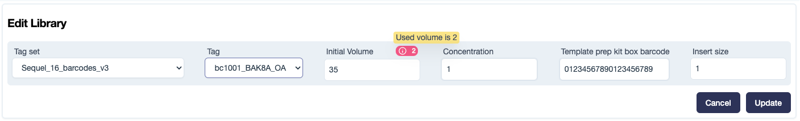

# Introduction

Volume Tracking is the process of monitoring the volume of each aliquot created from a sample, ensuring there is sufficient sample volume available for further sequencing. This involves recording the initial sample volume and meticulously tracking the volume of every aliquot derived(/used volume) from it. 

The following are the contexts where the Traction UI allows users to record the volume associated with aliquots:

1. Recording an Intial Sample Volume 
    The initial sample volume is recorded:
    - When creating or editing a library
    - When creating or editing a pool

2.  Recording a Used Volume
    The used sample volume is recorded:
    - When a library is used in a pool
    - When a library is used in a run
    - When a pool is used in a run 

## How volume tracking information is displayed in Traction

### When editing an existing library
When editing a library, the used volume of the library is displayed as a badge (as shown in the figure below), with a tooltip that appears on hover.
Validation: If the user enters a value less than already used volume for the library, an error will be displayed on the page, and the user will not be allowed to update the laibrary.

<figure markdown="span">
  
  <figcaption>Edit library</figcaption>
</figure>

