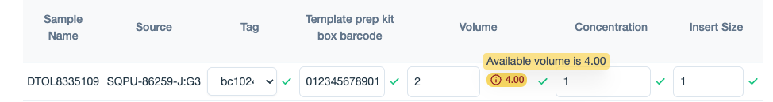

# Displaying volume tracking information

Volume Tracking is the process of monitoring the volume of each aliquot created from a sample, ensuring there is sufficient sample volume available for further sequencing. This involves recording the initial sample volume and meticulously tracking the volume of every aliquot derived(/used volume) from it.

The following are the contexts where the Traction allows users to record the volume associated with aliquots:

## 1. Recording an Initial Sample Volume

The initial sample volume is recorded:

- When creating or editing a library
- When creating or editing a pool

## 2. Recording a Used Volume

The used sample volume is recorded:

- When a library is used in a pool
- When a library is used in a run
- When a pool is used in a run

## When editing an existing library

#### Displayed Information:

When editing an existing library, the used volume is displayed as a pink badge (as shown in the figure below), with a tooltip that appears on hover in the library edit section.

<figure markdown="span">
  
</figure>

#### Volume check:

If the user enters a value less than already used volume for the library, an error will be displayed on the page, and the user will not be allowed to update the library.

<figure markdown="span">
  
</figure>

## When editing an existing pool

#### Displayed Information:

When editing an existing pool, the used volume of the library is displayed as a pink badge (as shown in the figure below), with a tooltip that appears on hover in the 'Pooled Samples' -> 'Pooled Information' section of the pool edit page.

<figure markdown="span">
  
</figure>

#### Volume check:

If the user enters a value less than already used volume for the pool, an error will be displayed on the page, and the user will not be allowed to update the pool.

<figure markdown="span">
  
</figure>

## When a library is used in a pool

#### Displayed Information:

When adding a library to a pool, or when editing a library used in an existing pool, the available volume is displayed as a yellow badge (as shown in the figure below), with a tooltip that appears on hover in the 'Pooled Samples' -> 'Pooled Information' section of the pool edit page.

<figure markdown="span">
  
</figure>

#### Volume check:

If the user enters a value greater than the available volume for the library, an error will be displayed on the page (as shown in the figure below), and the user will not be allowed to create or update the pool.

<figure markdown="span">
  
</figure>

## When a library is used in a run

#### Displayed Information:

When adding a library to a run, or when editing a run used in an existing run, the available volume is displayed as a yellow badge (as shown in the figure below), with a tooltip that appears on hover in the 'Add Pool or Library to Well' dialog invoked from of the run edit page.

<figure markdown="span">
  
</figure>

#### Volume check:

If the user enters a value greater than the available volume for the library, an error will be displayed on the page (as shown in the figure below), and the user will not be allowed to create or update the run.

<figure markdown="span">
  
</figure>

## When a pool is used in a run

#### Displayed Information:

When adding a pool to a run, or when editing a run used in an existing run, the available volume is displayed as a yellow badge (as shown in the figure below), with a tooltip that appears on hover in the 'Add Pool or Library to Well' dialog invoked from of the run edit page.

<figure markdown="span">
  
</figure>

#### Volume check:

If the user enters a value greater than the available volume for the pool, an error will be displayed on the page (as shown in the figure below), and the user will not be allowed to create or update the run.

<figure markdown="span">
  
</figure>
