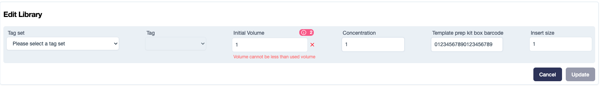
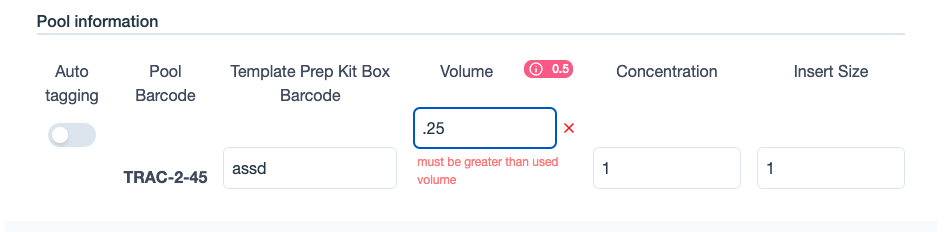

# Recording volume tracking information

Volume Tracking is the process of monitoring the volume of each aliquot created from a sample, ensuring there is sufficient sample volume available for further sequencing. This involves recording the initial sample volume and meticulously tracking the volume of every aliquot derived(/used volume) from it.

The following are the contexts where the Traction allows users to record the volume associated with aliquots:

###### Recording an Initial Sample Volume

- When creating or editing a library
- When creating or editing a pool

###### Recording a Used Volume

- When a library is used in a pool
- When a library is used in a run
- When a pool is used in a run

## 1. When editing an existing library

#### Recording initial volume:

The 'Initial Volume' field (as shown in the figure below) indicates the original volume allocated to the library at the time of creation. It can be edited or updated to a different value later as needed.

When editing an existing library, the used volume for the library so far is displayed as a pink badge (as shown in the figure below), with a tooltip that appears on hover in the library edit section. This allows the user to understand how much of the library's volume has been used so far, ensuring that the initial volume can be edited but never set to less than the already used volume.

<figure markdown="span">
  
</figure>

#### Volume check:

If the user enters a value less than already used volume for the library, an error will be displayed on the page, and the user will not be allowed to update the library.

<figure markdown="span">
  
</figure>

## 2. When editing an existing pool

#### Recording initial volume:

The 'Volume' field (as shown in the figure below) in the 'Pooled Samples' -> 'Pooled Information' section of the pool creation/edit page indicates the original volume allocated to the pool at the time of creation. It can be edited or updated to a different value later as needed. 

When editing an existing pool, the used volume for the pool so far is displayed as a pink badge (as shown in the figure below), with a tooltip that appears on hover. This allows the user to understand how much of the pool's volume has been used so far, ensuring that the initial volume can be edited but never set to less than the already used volume.

<figure markdown="span">
  
</figure>

#### Volume check:

If the user enters a value less than already used volume for the pool, an error will be displayed on the page, and the user will not be allowed to update the pool.

<figure markdown="span">
  
</figure>

## 3. When a library is used in a pool

#### Recording used volume

The 'Volume' field (as shown in the figure below) in the 'Pooled Samples' section of the pool creation/edit page indicates the volume allocated to the library in the pool, or the used volume of the library in the pool. It can be edited or updated to a different value later as needed.

When adding a library to a pool, or when editing a library used in an existing pool, the available volume is displayed as a yellow badge (as shown in the figure below), with a tooltip that appears on hover. The available volume for the library displayed in this context will be

$$
- V_{availble_volume_library} = V_{actual_available_volume} + V_{used_volume_for_library_in_given_pool}
$$

where
- *V_{availble_volume_library} represents the total volume of the library that is available to be allocated or used in the pool, as shown in the yellow badge. This is the value being displayed to the user.*
- *V_{actual_available_volume} is the current actual available volume of the library, meaning the remaining amount of volume that has not been allocated or used anywhere yet.*
- *V_{used_volume_for_library_in_given_pool} represents the volume of the library that has already been used or assigned in the specific pool being edited.*
This way, the user can see how much library volume is available to allocate to the pool without exceeding the total available volume for the library.

<figure markdown="span">
  
</figure>

#### Volume check:

If the user enters a value greater than the available volume for the library, an error will be displayed on the page (as shown in the figure below), and the user will not be allowed to create or update the pool.

<figure markdown="span">
  
</figure>

## 4. When a library is used in a run

#### Recording used volume:

The 'Volume' field (as shown in the figure below) in the 'Add Pool or Library to Well' dialog invoked from of the run edit page indicates the volume allocated to the library in the run, or the used volume of the library in the run. It can be edited or updated to a different value later as needed.

When adding a library to a run, or when editing a run used in an existing run, the available volume is displayed as a yellow badge (as shown in the figure below), with a tooltip that appears on hover. The available volume for the library displayed in this context will be

$$
- V_{availble_volume_library} = V_{actual_available_volume} + V_{used_volume_for_library_in_given_run}
$$

where
- *V_{availble_volume_library} represents the total volume of the library that is available to be allocated or used in the run, as shown in the yellow badge. This is the value being displayed to the user.*
- *V_{actual_available_volume} is the current actual available volume of the library, meaning the remaining amount of volume that has not been allocated or used anywhere yet.*
- *V_{used_volume_for_library_in_given_run} represents the volume of the library that has already been used or assigned in the specific run being edited.*

This way, the user can see how much library volume is available to allocate to the run without exceeding the total available volume for the library.

<figure markdown="span">
  
</figure>

#### Volume check:

If the user enters a value greater than the available volume for the library, an error will be displayed on the page (as shown in the figure below), and the user will not be allowed to create or update the run.

<figure markdown="span">
  
</figure>

## 5. When a pool is used in a run

#### Recording used volume:

The 'Volume' field (as shown in the figure below) in the 'Add Pool or Library to Well' dialog invoked from of the run edit page indicates the volume allocated to the pool in the run, or the used volume of the pool in the run. It can be edited or updated to a different value later as needed.

When adding a pool to a run, or when editing a run used in an existing run, the available volume is displayed as a yellow badge (as shown in the figure below), with a tooltip that appears on hover. The available volume for the pool displayed in this context will be

$$
- V_{availble_volume_pool} = V_{actual_available_volume} + V_{used_volume_for_pool_in_given_run}
$$

where
- *V_{availble_volume_pool} represents the total volume of the pool that is available to be allocated or used in the run, as shown in the yellow badge. This is the value being displayed to the user.*
- *V_{actual_available_volume} is the current actual available volume of the pool, meaning the remaining amount of volume that has not been allocated or used anywhere yet.*
- *V_{used_volume_for_pool_in_given_run} represents the volume of the pool that has already been used or assigned in the specific run being edited.*

This way, the user can see how much pool volume is available to allocate to the run without exceeding the total available volume for the pool.

<figure markdown="span">
  
</figure>

#### Volume check:

If the user enters a value greater than the available volume for the pool, an error will be displayed on the page (as shown in the figure below), and the user will not be allowed to create or update the run.

<figure markdown="span">
  
</figure>
